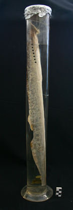

- **Número de inventário:** MC\MB\AC\V\1
- **Categoria:** Biologia/Zoologia
- **Denominação:** 
  - **vulgar** - Lampreia-marinha
  - **científica** - *Petromyzon marinus*
- **Descrição:** Corpo longo com manchas irregulares escuras; sem mandíbula e com boca circular em forma de ventosa com grande número de dentes uniformemente distribuídos; barbatanas dorsais com dois lobos bem separados e sem barbatanas peitorais. 
**Taxonomia:** Família *Petromyzontidae* (1),  Género *Petromyzon* (1), Espécie *L. marinus* (1) 
- **Observações:**

